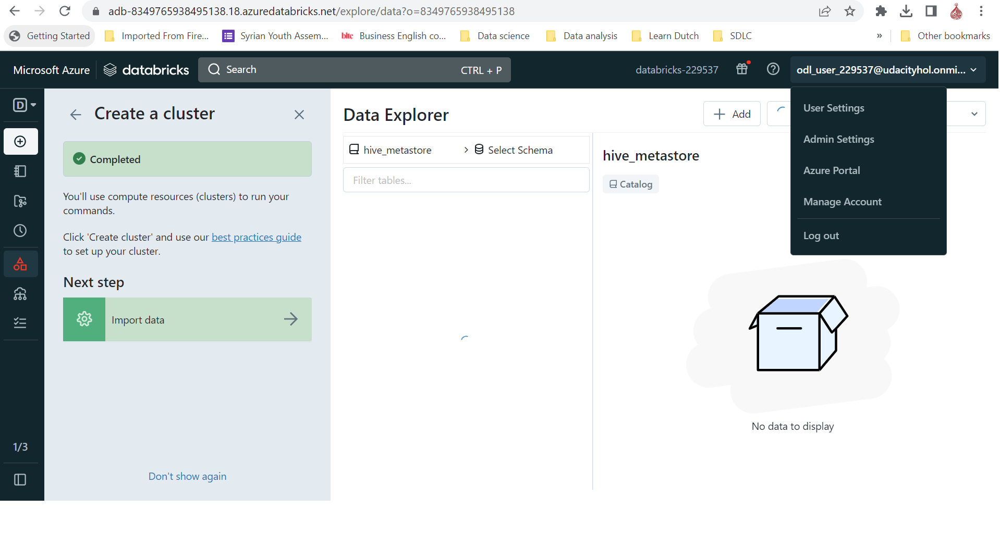
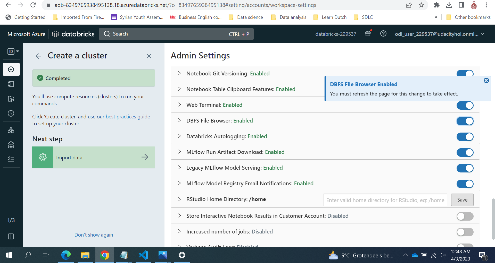
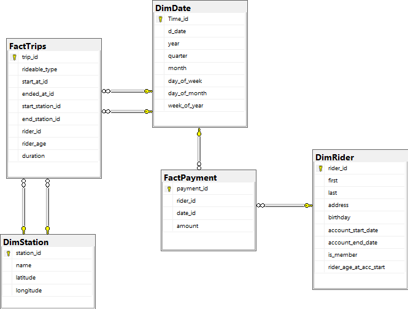
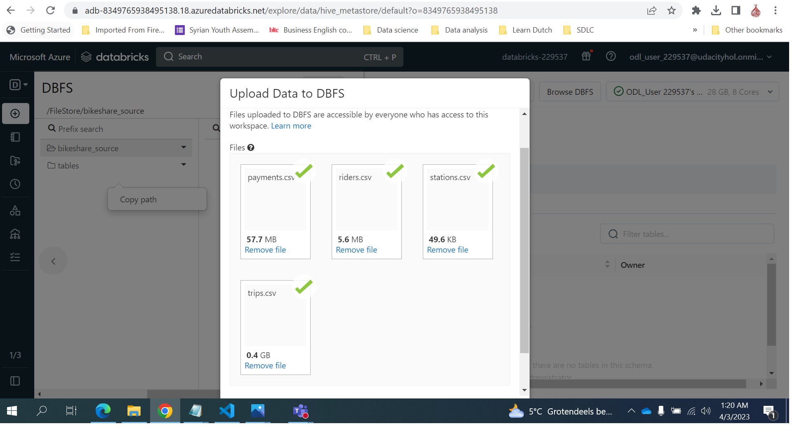
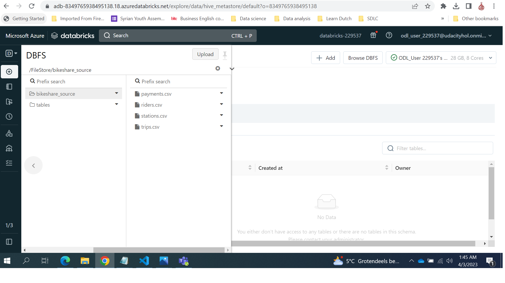
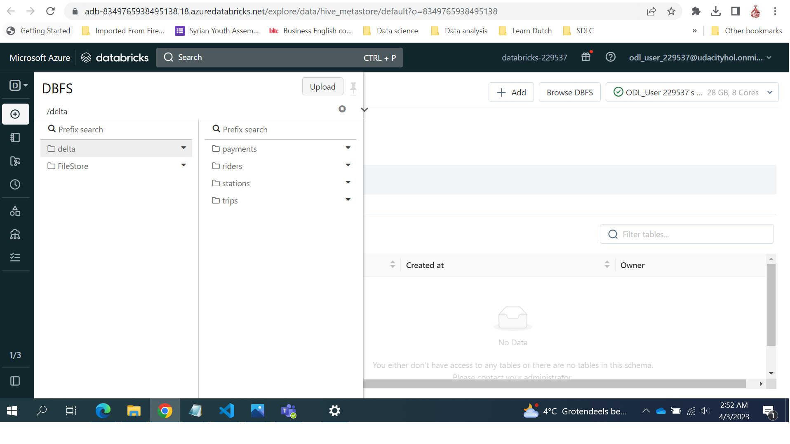
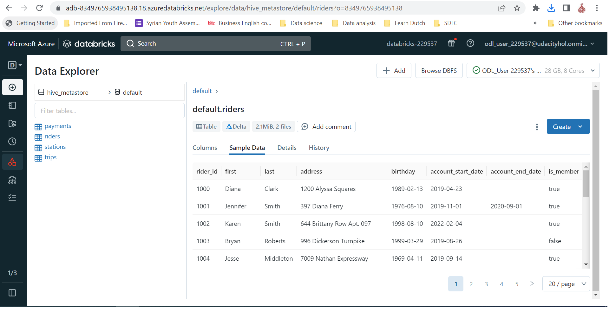
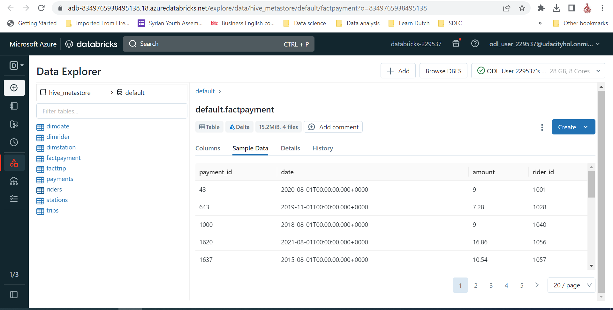
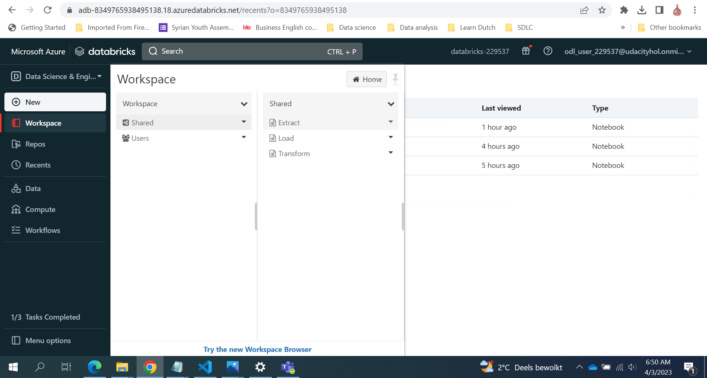

## Project: Building an Azure Data Lake for Bike Share Data Analytics
Divvy is a bike sharing program in Chicago, Illinois USA that allows riders to purchase a pass at a kiosk or use a mobile application to unlock a bike at stations around the city and use the bike for a specified amount of time. The bikes can be returned to the same station or to another station. The City of Chicago makes the anonymized bike trip data publicly available for projects like this where we can analyze the data.

## Project goal
The goal of this project is to develop a data lake solution using Azure Databricks using a lake house architecture. You will:

- Design a star schema based on the business outcomes listed below.
- Import the data into Azure Databricks using Delta Lake to create a Bronze data store
- Create a gold data store in Delta Lake tables
- Transform the data into the star schema for a Gold data store.

#### The business outcomes you are designing for are as follows:

Analyze how much time is spent per ride
- Based on date and time factors such as day of week and time of day
- Based on which station is the starting and / or ending station
- Based on age of the rider at time of the ride
- Based on whether the rider is a member or a casual rider

Analyze how much money is spent
- Per month, quarter, year
- Per member, based on the age of the rider at account start

EXTRA CREDIT - Analyze how much money is spent per member
- Based on how many rides the rider averages per month
- Based on how many minutes the rider spends on a bike per month

## Instructions
The below diagram shows the project architecture.  
- Create your Azure resources.
- Design a star schema. 
- Ingest csv files to Databricks File Storage(DBFS).
- Extract Data from DBFS to Delta files.
- LOAD Delta files to Delta Tables.
- TRANSFORM the data to the star schema

### Create your Azure resources
- Create and Launch Databricks workspace.

- Create Cluster 

- Enable Databricks File storage Browser

### Design a star schema.
To provide a relational schema that describes the data . In addition, the designed should address given set of business requirements related to the data warehouse.The below ERD describe the **star schema** with tow Fact tables for payemts and trips surrounded by dimensions tables

### Ingest csv files to Databricks File Storage(DBFS)
To prepare your Databricks environment for this project, you first must import csv data files to DBFS.

- You can verify uploaded csv data by browsing DBFS.

### Extract Data from DBFS to Delta files.
Using pyspark you can Extract Data from DBFS and saving as Delta files ,
you can find  [pyspark Extract code](../../raw/main/Extract.ipynb)

### LOAD Delta files to Delta Tables.
Using pyspark code to load data from Delta files and save as Delta Tables,
you can find  [pyspark Load code](../../raw/main/Load.ipynb)

### TRANSFORM the data to the star schema
pyspark code to transform the data from the staging tables to the final star schema you designed.
you can find [pyspark Load code](../../raw/main/Transform.ipynb)

All working pyspark code Extract, Load and Transforme saved in DataBricks workspace

