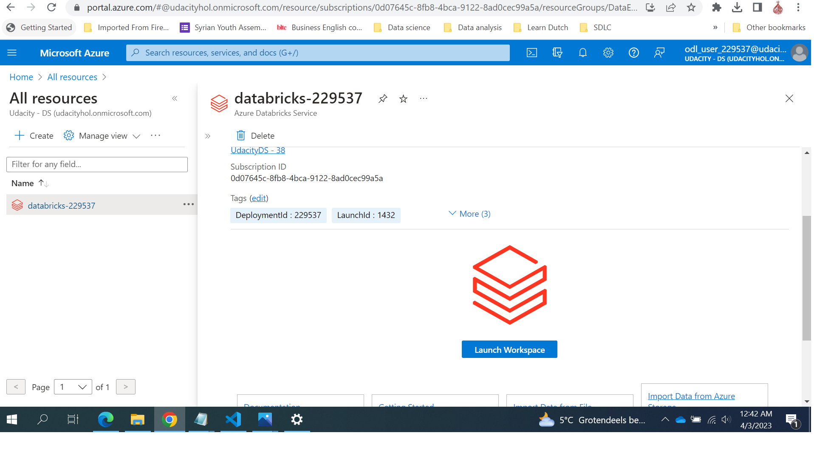
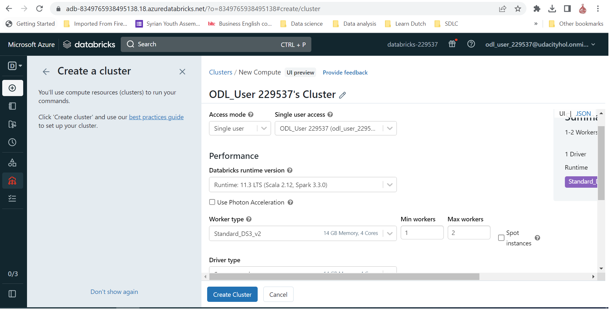

## Project: Building an Azure Data Lake for Bike Share Data Analytics
Divvy is a bike sharing program in Chicago, Illinois USA that allows riders to purchase a pass at a kiosk or use a mobile application to unlock a bike at stations around the city and use the bike for a specified amount of time. The bikes can be returned to the same station or to another station. The City of Chicago makes the anonymized bike trip data publicly available for projects like this where we can analyze the data.


## Project goal
The goal of this project is to develop a data lake solution using Azure Databricks using a lake house architecture. You will:

- Design a star schema based on the business outcomes listed below.
- Import the data into Azure Databricks using Delta Lake to create a Bronze data store
- Create a gold data store in Delta Lake tables
- Transform the data into the star schema for a Gold data store.

#### The business outcomes you are designing for are as follows:

Analyze how much time is spent per ride
- Based on date and time factors such as day of week and time of day
- Based on which station is the starting and / or ending station
- Based on age of the rider at time of the ride
- Based on whether the rider is a member or a casual rider

Analyze how much money is spent
- Per month, quarter, year
- Per member, based on the age of the rider at account start

EXTRA CREDIT - Analyze how much money is spent per member
- Based on how many rides the rider averages per month
- Based on how many minutes the rider spends on a bike per month


## Instructions
The below diagram shows the project architecture.  
- Create and Launch Databricks workspace.
- Design a star schema. 
- Ingest csv files to Databricks File Storage(DBFS).
- Extract Data from DBFS to Delta files.
- LOAD Delta files to Delta Tables
- TRANSFORM the data to the star schema


### Create and Launch Databricks workspace.
Using Azure portal to create and launch Databricks workspace 



Create Cluster 



### Design a star schema.
To provide a relational schema that describes the data as it exists in PostgreSQL. In addition, the designed should address given set of business requirements related to the data warehouse.The below ERD describe the **star schema** with tow Fact tables for payemts and trips surrounded by dimensions tables


also you can find the 
[Star Schema SQL script](../../raw/main/SQLScript/Star_schema.sql).


### Create the data in PostgreSQL
To prepare your environment for this project, you first must create the data in PostgreSQL. This will simulate the production environment where the data is being used in the OLTP system. This can be done using the Python script provided for you in Github: ProjectDataToPostgres.py

- Download the script file and place it in a folder where you can run a Python script
- Download the data files from the classroom resources
- Open the script file in VS Code and add the host, username, and password information for your PostgreSQL database
- Run the script and verify that all four data files are copied/uploaded into PostgreSQL


- You can verify this data exists by using pgAdmin or a similar PostgreSQL data tool.


### EXTRACT the data from PostgreSQL.
In your Azure Synapse workspace you will 
- Use the ingest wizard to create a one-time pipeline that ingests the data from PostgreSQL into Azure Blob Storage.


- This will result in all four tables being represented as text files in Blob Storage, ready for loading into the data warehouse.


### LOAD the data into external tables in the data warehouse.
Once in Blob storage, the files will be shown in the data lake node in the Synapse Workspace. From here, you can use the script-generating function to load the data from blob storage into external staging tables in the data warehouse.
also you can find SQL script for External Tables : [payment](../../raw/main/SQLScript/stage_payment.sql) , [rider](../../raw/main/SQLScript/stage_rider.sql),[station](../../raw/main/SQLScript/stage_station.sql) and  [trip](../../raw/main/SQLScript/stage_trip.sql)


### TRANSFORM the data to the star schema
SQL scripts to transform the data from the staging tables to the final star schema you designed.
you can find [Transform script](../../raw/main/SQLScript/Transform.sql)


### Applied data analysis
After applied all previous steps , now it is time to do example of data analysis by invoke  [SQL Query](../../raw/main/SQLScript/Analysis.sql) on Star Schema to extract total payments by year, quarter and month
```sql
SELECT 
	t2.year
	,t2.quarter 
	,t2.month
	,sum([amount]) as TotalAmount
FROM 
	[dbo].[FactPayment] t1
 	join [dbo].[DimDate] t2 on t1.date_id=t2.time_id
group by 
	t2.year,t2.quarter ,t2.month
order by 
	1,2,3
```


